## Bir Metin Nasıl Korunur?
Bir kaç yüz sayfalık bir metnin asırlarca değişmeden kalması olağan bir durum değildir. Yazarı hayatta ise, ilk yazdıklarını beğenmez, sürekli daha iyisini yazmaya çalışır. Yazarı öldükten sonra metin hâlâ yaşıyorsa, bu sefer metni kopyalayanlar değiştirir. Asıl metne sadakati bozmanın üç sebebi olabilir: a) Hafıza ya da okuma hatası ile, b) Daha iyisini yapıyorum zannı ile, c) Tahrif etmek niyeti ile. Sebep ne olursa olsun, bildiğimiz bütün edebi ve tarihi metinler bu değişimden kurtulamamış. Tek istisna Kuran-ı Kerim:

15:9 **Doğrusu Kitâbı Biz indirdik, koruyucusu elbette Biziz.**

Metnin muhafazasının, yani asırlarca korunmasının ne kadar zor olduğunu özellikle benzer ayet çiftlerinde okuyoruz. Aşağıda verilen birkaç çift ayet, konuyu açıklayan örneklerden ibaret. Bunlar gibi çok benzerlik bulunabilir.

### 1. Eşanlamlı kelimeler
Bu örnekte **ersil** ve **ib'as**, ikisi de "gönder" anlamında. Lakin A'raf suresinde biri kullanılırken, Şu'ara suresinde diğer kelime var. Hafızlar iki ayeti karıştırmadan doğru kelime ile okumak zorunda.
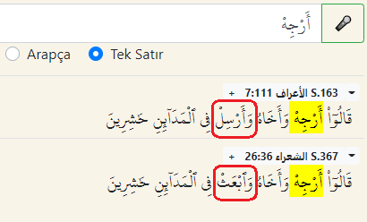

https://okuyun.github.io/Kuran/#b=%3Earojiho

### 2. Kelime sırası
En'am suresinde "la'iben ve lehven", A'raf suresinde "lehven ve la'iben".
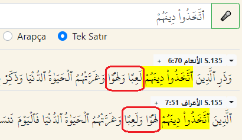

https://okuyun.github.io/Kuran/#b={t~axa*uwA@%20diynahumo

Başka bir ifade, "ebvâbe cehennem" ufak farklarla üç ayette geçiyor:
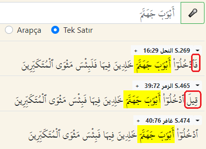

https://okuyun.github.io/Kuran/#b=%3Eabowa%60ba%20jahan~ama

### 3. İmlâ farklı
Kerim Kitâbımızın korunmuşluğuna ilginç bir örnek "key lâ" kelimesi. 7 âyette geçen bu söz bazan bitişik yazılıyor, bazan ayrılmış iki kelime, anlam değişmediği halde imlâsı farklı. Bütün mushaflarda bu ayrıntı korunmuş: [3 yerde ayrı](/Kuran/#b=kaYo%20laA), hiç farklı görünmeyen [4 yerde bitişik](/Kuran/#b=kayolaA) yazılıyor. Nahl suresinde iki kelime halinde iken, Hacc suresinde aynı ifade içindeki boşluk silinir ve tek kelime kalır. Bu örneği zorlaştıran ikinci fark, *min* kelimesi bir ayette var, diğerinde yok.
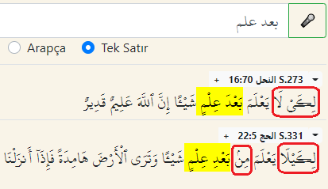

https://okuyun.github.io/Kuran/#b=bEd%20Elm

Şu örnekte yine okunuş ve anlam aynı, imlâ farklı. Neml suresinde fazladan bir yâ harfi var, kırâati ve mânâyı değiştirmediği halde mushaflarda muhafaza edilmiş.
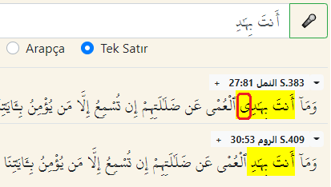

https://okuyun.github.io/Kuran/#b=%3Eanta%20biha%60di

"Neden böyle yazılıyor?" sorusu Arapça dilbilgisi açısından ilginç olabilir, ama asıl sorumuz o değil... Nasıl olmuş da bu ufacık ayrıntı asırlar boyu değişmeden korunmuş? 

### 4. Zamirler

Aynı şeyi söyleyen ayet çiftlerinde kullanılan farklı zamirlere bakalım. Bu amaç için, "o, onu, onun" anlamındaki iki zamiri tanımak yeterli:
* hu -- müzekker (eril)
* hâ -- müennes (dişil)

Mesela sahabeden söz ederken bu farkı gözeterek Hz Ebubekir için "radiyallahu 'anhu", Hz Aişe için "radiyallahu 'anhâ" deriz. Arada sadece bir elif farkı var.

İlk örneğimiz "sizi sularız, size içiririz" anlamındaki **nusqîkum** kelimesi, hayvanlardan aldığımız sütü anlatıyor. "Karınlarından" derken kullanılan zamirlerin biri müzekker butûnihi, diğeri müennes butûnihâ:

https://okuyun.github.io/Kuran/#b=nsqykm

İkinci örnek "öğüt" anlamına gelen **tezkiratun**. Kendisi müennes olan bu kelime, aslında Kur'an için kullanılıyor. Buna işaret eden zamir ise iki yerde müzekker innehû, iki yerde müennes hâzihî ("bu" anlamında işaret zamiri), bir yerde de müennes innehâ:
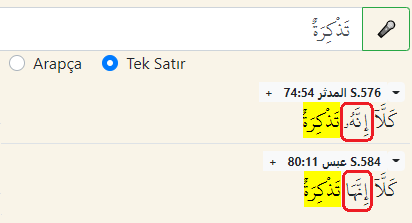

https://okuyun.github.io/Kuran/#b=ta*okirapN

Son olarak, Hz İsa'nın babasız yaratılışını hatırlatan iki ayette "üfledik" anlamında **nefahnâ**. Bu kelimeden sonra gelen zamirlerin biri müennes **fîhâ**, diğeri müzekker **fîhi**:

https://okuyun.github.io/Kuran/#b=nfxnA

Burada vurgulanan farkların, ayetin anlamını değiştirmediği çok açık. Peki neden böyle bir titizlik gerekiyor? Çünkü mesajın aslı öyle, harfler aslına uygun korunmuş.

### 5. Bir Elif Farkı
35 yıl önce, bilgisayarda Kuran okumak henüz bir hayal iken, _subhâne_ kelimesini araştırmak bir tam gün sürmüştü. Her kelimenin hangi ayetlerde geçtiğini endeksleyen Mucem kitaplarını kullanıyorduk o zaman. Şimdi sonuçlar saniyede çıkıyor.

**Finder** yazılımı _subhâne_ kelimesinin aynen geçtiği 40 ayeti gösteriyor:
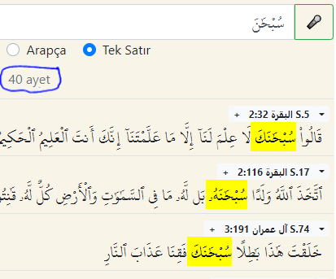

https://okuyun.github.io/Kuran/#b=suboHa%60na

**Mucem** yazılımı sin-bâ-Hâ kökünden türeyen kelimelerin 92 kere kullanıldığını gösteriyor. Sol üst köşedeki Liste düğmesi ile, bu kökün türevlerine erişin. Şimdi _subhâne_ kelimesini seçerek şu listeye ulaşın:
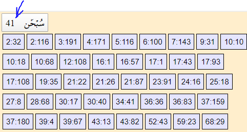

https://okuyun.github.io/Kuran/#r=sbH

Iqra yazılımının iki modülünden Mucem 41 derken Finder 40 ayet buldu. Neden iki sayı farklı? Hayır yazılım hatası değil! Kitabın korunmuşluğunun çok ince bir göstergesi.

**Corpus** -- "Bilgisayarda Mucem" projesinin kaynağı ve Iqra yazılımının verilerini sağlayan Corpus sayfasında da 41 sayısı çıkıyor:
'[subhane_corpus](subhane_corpus.png)

http://corpus.quran.com/qurandictionary.jsp?q=sbH

İki yazılımın verdiği listeleri tek tek kıyaslayınca İsra suresinin 17:93 ayeti bulunuyor. Peki neden? İkinci hecenin uzun A sesi, bu ayette elif ile gösterilmiş, standart yazımda ise elif değil çekme işareti var. Yani kelime aynı, okunuşu da aynı. Sadece bir elifin yazılışında fark var. Türkçede _subhane_ ve _subhâne_ arasındaki fark gibi... Uzatma işaretini koysak da koymasak da bu A uzun okunur, iki imlâ da doğrudur.

https://quran.com/17/1 ve https://quran.com/17/93  
http://corpus.quran.com/translation.jsp?chapter=17&verse=1

Ülkemizdeki mushaflarda bu farkın muhafaza edilmediğini gözledim. Hepsi elif ile yazılmış. Medine mushaflarında farkı açıkça görebilirsiniz. Yukarıdaki resmi iki ayrı web sitesinden derledim.

Peki ne önemi var? Anlam değişmediği halde, bir elifin gösterimindeki farklar bile korunmuş. Demek ki bir hikmeti var... Katiplerin hatası deyip çıkmak pek kolay değil, çünkü aynı surede bir kaç sayfa öncesinde (17:43) ve iki sayfa sonrasında (17:108) bu kelime standarda uygun yazılmış, sadece bu ayette farklı olduğu için Finder onu bulamadı. Seslileri silerek arayınca yine 41 sayısı bulunur:

https://okuyun.github.io/Kuran/#b=sbHAn

Üstelik tek örnek bu değil. İbrahim kelimesi (Türkçe farklı yazımları olduğu gibi) Medine mushaflarında iki türlü yazılmış. Standart yazımda yâ harfi açıkça yazılırken, Bakara suresinde çekme işaretiyle gösterilmiş:

https://quran.com/2/127 ve https://quran.com/3/33

### 6. Nimet, Sunnet, Rahmet
Bu üç kelimenin anlamına değil yazılışına bakalım. Üç kelimenin de son sesi olan T, köküne ait değil. Müennes te'si, çoğu zaman çift noktalı he ile yazlıyor. Bazan ama normal te'ye dönüşüyor. **Nimet** kelimesi ile başlayalım:
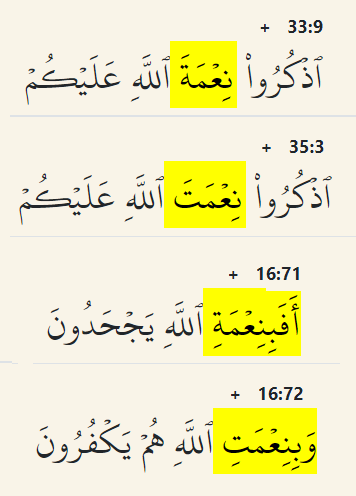

uzkurû ni'me  ve  bini'me

Yukarıda ni'metallah tamlamasının iki farklı yazılışı görülüyor, şeklin altında ise bini'metillah. Özellikle aşağıdaki Nahl suresi örneği önemli, çünkü ardarda iki ayette bir öyle bir böyle yazılmış fark ve aynen korunmuş.

**Sunnet** kelimesi için de benzeri bir tablomuz var:

lisunneti  ve  sunnetul-evvelin

Üstte lisunnetillah tamlamasının iki farklı yazılışı görülüyor, şeklin altında ise özne halinde sunnetul-evvelîn. "Neden böyle yazılır, ne anlamı var?" sorularına hiç girmeden, korunmuş ilginç ayrıntılar olarak kaydediyoruz. Rahmet kelimesi için de benzeri farklar var, ama bu kelime çok sayıda geçtiği için örneklere dahil edilmedi.

### 7. Sin mi Sad mı?
Kökünde sin harfinden sonra kalın tâ gelen iki kelimenin imlasında sin sad'a dönüşebiliyor. Birinde harfin okunuşu değişmezken diğerinde ses kalınlaşıyor:

besta  ve  musaytir

İlk kelimenin kökü bâ-sin-tâ: Biri hariç bütün türevlerinde (yebsutu, bâsit, mebsûta) sin harfi ve sesi değişmiyor. Söz konusu besta kelimesi iki kere geçiyor, ses olarak ikisi de sin, ama yazıda biri sad'a dönüşüyor.

Diğer kelimenin kökü sin-tâ-râ: Biri hariç bütün türevlerinde (esâtir, yesturu, mestûr) sin harfi ve sesi değişmiyor. Söz konusu musaytir kelimesi iki kere geçiyor, hem ses hem yazı olarak ikisi de sad'a dönüşüyor. Korunmuşluğun ayrıntıları beklenmedik bir karmaşıklık gösteriyor.

### Korunmamış bir kitap
Bir de korunmamış kitap örneği ile konuyu açıklamak isterim. Aslında, bunun için örnek gerekmez, çünkü tahrif istisna değil kuraldır. İstisna olan korunmuşluk, sadece bir Kitab için geçerli.

Mesnevi'deki tahrifin hikayesi, daha ilk satırda hikaye kelimesiyle başlıyor:
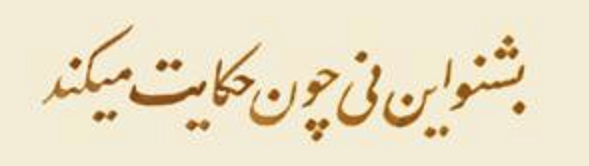

_bişnev in ney çun hikâyet mîkuned_

Mevlevi kaynaklarda aslına uygun olan metnin yukarıdaki gibi olduğu söylenirken, basılı kitapların ve web sayfalarının çoğunda muharref metni okuyoruz:
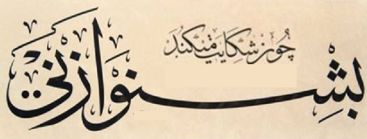

_bişnev ez ney çun şikâyet mîkuned_

Değişiklik yalnız bundan ibaret değil. 20 bin beyit içinde, sonradan eklenen, çıkarılan, değiştirilen çok örnek bulunabilir ki hepsi tahrif sayılır. Hemen eklemeliyim, bu zaaf Mesnevi'ye has değil, insan tabiatının bir gereği olarak bütün yazılı metinlerde gözlenebilir. İlahi koruma yoksa her metin tahrife açıktır.

### Referans
Mu’cem konusunda yaptığım ilk sunum: [Konya, Ekim 2015](https://maeyler.github.io/Sunumlar/Words%20in%20Quran.pdf)
<!--   3rd International Conference on Islamic Applications in Computer
Science and Technologies – [IMAN 2015](http://www.dsr.edu.my/iman/iman2015.html) -->

Mu’cem Kitapları ile Yazılımın Kıyası: [Istanbul, Temmuz 2017](https://maeyler.github.io/Sunumlar/Kuran%20Fihristi%20outline.pdf)

Pandemi nedeniyle evde geçirdiğimiz ilk Ramazan ayında ortaya çıkan bir yazı dizisi: [Nisan 2020](https://korunmuskitap.blogspot.com/2020/04/)

